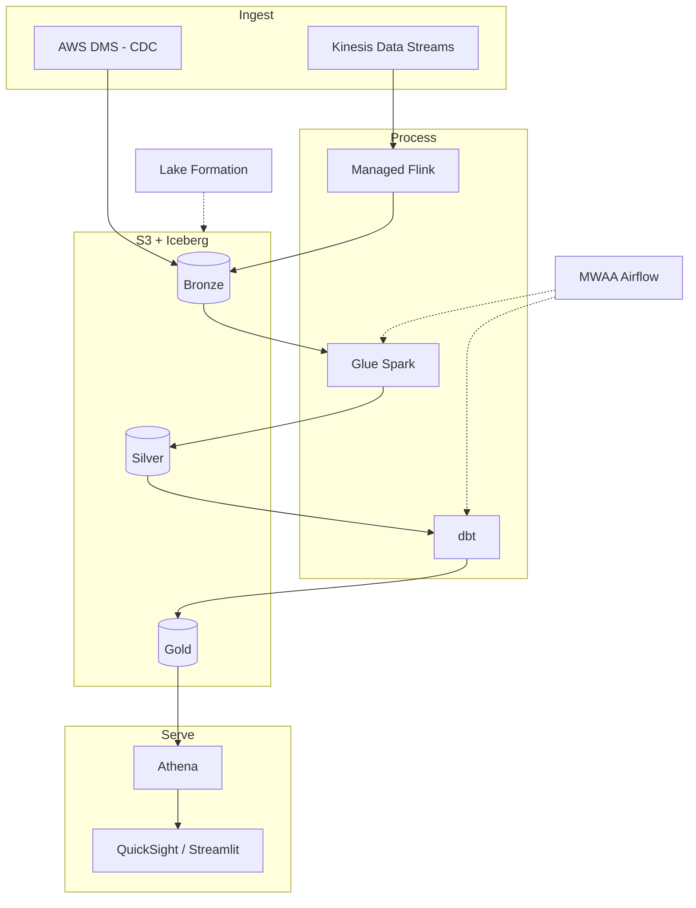

# Architecture — Real-Time E-Commerce Lakehouse on AWS

This document goes deeper than the README. It explains how the pieces fit, why each one is there, and what I would change as the system grows.

## High-level view

## Why a lakehouse and not a warehouse

A pure warehouse (load everything into Redshift) would have been simpler to start, but it couples storage and compute and makes raw, replayable history expensive. A pure data lake (files on S3, query with Athena) is cheap but has no transactions, so concurrent writes and schema changes get painful.

Iceberg on S3 gives the middle ground: object-storage economics with ACID transactions, hidden partitioning and time travel. Athena, Glue and EMR all read and write the same tables, so I am never locked to one engine.

## The streaming side

Clickstream is high volume and bursty. Kinesis is a good fit: it is a serverless, replayable log, and the shard model lets me scale throughput without managing brokers.

Flink does the work that has to happen in motion. Sessionization needs state (group events by user until they go quiet for 30 minutes), and enrichment with a product lookup is cheaper in the stream than as a later join. Everything that does not need streaming state is deliberately pushed downstream to batch, because batch is cheaper and easier to reason about.

Orders are different. They live in a transactional database and change after the fact (a refund updates an existing order). That is a change-data-capture problem, so DMS streams the row changes and Iceberg's MERGE handles the upserts in silver.

## The batch side and the medallion layers

- **Bronze** is append-only and never edited. If a downstream layer is wrong, I can rebuild it from bronze. This is the single most important property of the design.
- **Silver** is where Spark does the heavy lifting: dedup, type coercion, schema conformance, MERGE for CDC. One clean row per event.
- **Gold** is dbt territory. Business logic in SQL, version controlled, tested, documented. Analysts can read and even contribute to it.

Splitting Spark (silver) from dbt (gold) is intentional. Spark is the right tool for messy, large-scale cleaning. SQL is the right language for business metrics, and keeping gold in dbt means the people who understand the metrics can own them.

## Orchestration

MWAA runs one DAG: refresh silver with Glue, build gold with dbt, run the quality gate, then publish. Tasks are idempotent so a retry never double-counts. The DAG fails closed, so a failed test leaves the last good gold tables in place rather than overwriting them with bad data.

## Governance

Lake Formation sits over the Glue Catalog and enforces table-level and column-level permissions. Analysts see gold. Engineers see everything. PII columns in silver are masked for anyone without the right tag.

## What I would change at scale

- Move Glue jobs to EMR Serverless if silver volume outgrows Glue's sweet spot.
- Add a small Kafka or MSK layer if more than a couple of teams start consuming the raw stream.
- Introduce a feature store if the recommendation use case grows past simple aggregates.
- Add OpenLineage for end-to-end lineage once more pipelines share these tables.

## Failure modes I planned for

- **Late and out-of-order events:** Flink watermarks plus Iceberg MERGE in silver, so a late event corrects the right row.
- **Schema drift from the source:** bronze accepts it, silver enforces the contract and quarantines what does not fit.
- **Backfills:** bronze is the source of truth, so a backfill replays bronze through the same Spark and dbt code, no special path.
