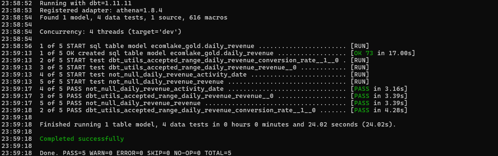
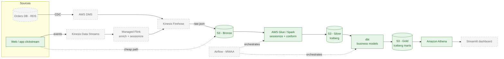
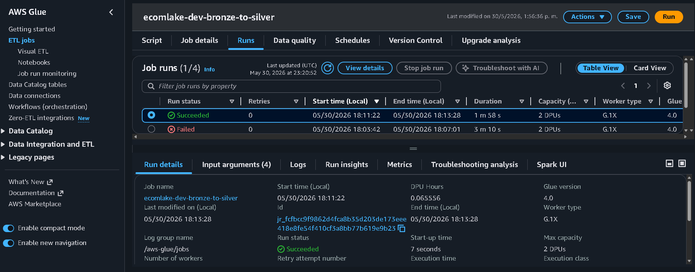
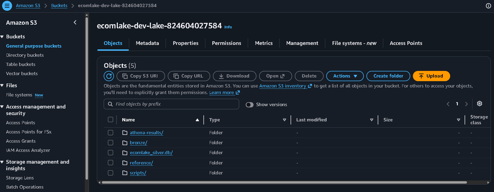
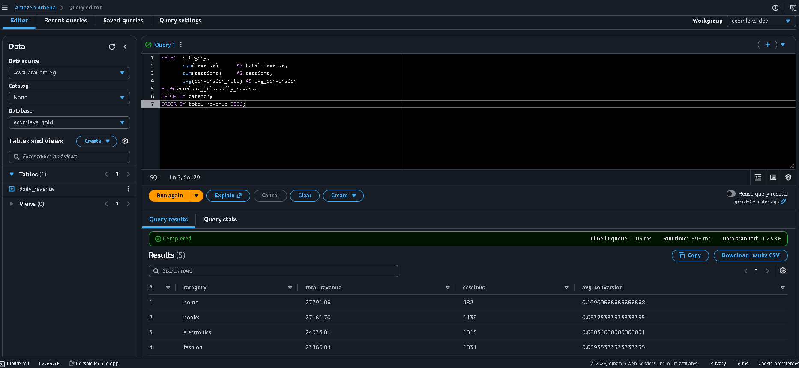
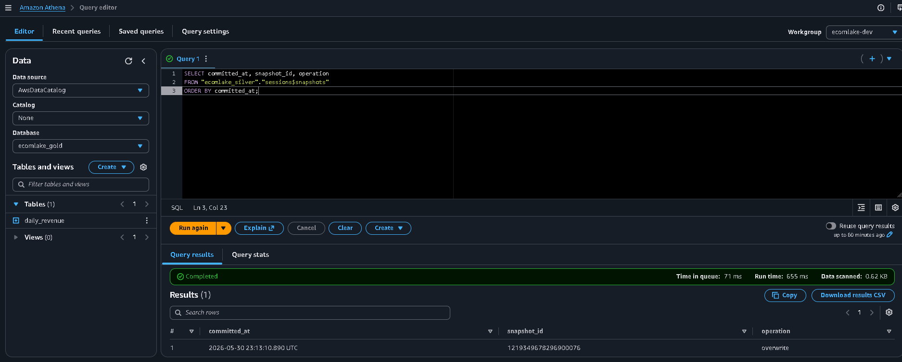
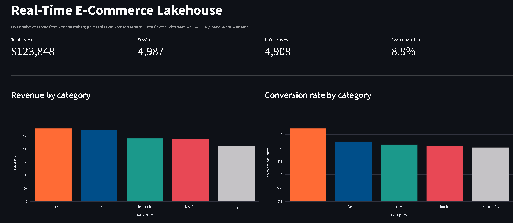
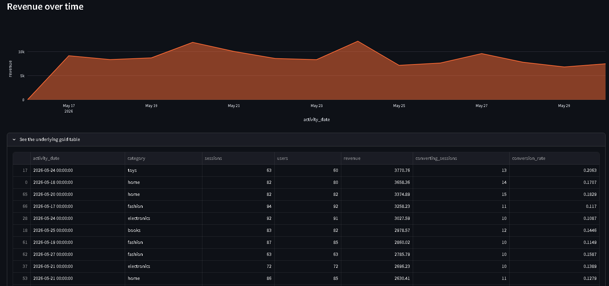

# Real-Time E-Commerce Lakehouse on AWS


A streaming lakehouse for an online store. Click events and orders land in seconds, get cleaned and modeled into a medallion architecture on Apache Iceberg, and become tables that analysts can query with plain SQL in Athena.

This is the project you can run yourself. `terraform apply`, send some sample events, and watch the data move from raw to gold.

> Full design and trade-offs live in [ARCHITECTURE.md](./ARCHITECTURE.md).

---

## Verified end to end

I deployed this on a real AWS account and ran the full pipeline. These are the actual numbers from that run:

| Stage | Result |
|---|---|
| Raw click events generated | 5,000 |
| Sessions built in silver (Glue + Iceberg `MERGE`) | 4,987 |
| Gold mart built by dbt | `daily_revenue` |
| Total revenue modeled in gold | $123,848 |
| Data quality tests | **5 passed, 0 failed** |
| Cost of the run | a few cents |



### Two ways to run it

The repo ships with a switch so you can deploy the part that fits your budget and account:

| Mode | Path | When to use |
|---|---|---|
| **Cheap path** (default) | sample events → S3 bronze → Glue (Spark + Iceberg) → dbt → Athena | What I verified above. Costs cents, no streaming services needed. |
| **Streaming path** (`enable_streaming = true`) | Kinesis → Firehose → S3 bronze → … | Adds the live streaming ingestion for the full real-time picture. |

Flip it with one Terraform variable. The Spark, dbt and Iceberg logic is identical either way, so the cheap path proves the whole transformation chain works.

---

## The problem

An e-commerce team wanted two things that usually fight each other: fresh data and trustworthy data. Marketing needed clickstream numbers within minutes to react to campaigns. Finance needed order data they could close the books on. The old setup was a nightly batch job that was both too slow for one group and not careful enough for the other.

So I split the difference with a lakehouse. Streaming gets the raw events in fast. The medallion layers add the quality controls on top, at their own pace, without blocking ingestion.

---

## Architecture

The diagram shows the full target design. Solid boxes are what I deployed and
verified on AWS. Dashed boxes are reference code in this repo for the streaming
and orchestration extensions (see [What is deployed vs reference](#what-is-deployed-vs-reference)).



### What is deployed vs reference

| Component | Status |
|---|---|
| S3 lake, Glue catalog, Athena workgroup, IAM, budget alarm (Terraform) | ✅ Deployed and verified |
| Glue Spark job: bronze → silver, with Iceberg `MERGE` and a quality contract | ✅ Deployed and verified |
| dbt gold mart + data quality tests on Athena | ✅ Deployed and verified |
| Kinesis + Firehose streaming ingestion | 🔁 Reference code, toggle with `enable_streaming` |
| Managed Flink sessionization job | 🔁 Reference code (the Glue job does the same work in batch) |
| AWS DMS change data capture | 🔁 Reference design, not provisioned |
| Amazon MWAA (Airflow) DAG | 🔁 Reference code, runs the same steps you can run by hand |

I kept the streaming and orchestration pieces as readable reference code on
purpose. The transformation core (Spark, Iceberg, dbt, Athena) is fully working,
and the cheap path proves that core end to end without paying for always-on
streaming infrastructure.

---

## Tech stack

| Layer | Service | Why | Status |
|---|---|---|---|
| Lake storage | Amazon S3 + Apache Iceberg | Open format, ACID, time travel, schema evolution | ✅ |
| Batch transform | AWS Glue (Spark) | Sessionize and conform bronze to silver | ✅ |
| Modeling | dbt-core (dbt-athena) | Silver to gold, with tests and docs | ✅ |
| Query / serving | Amazon Athena | Serverless SQL straight on Iceberg | ✅ |
| Catalog | AWS Glue Data Catalog | Table metadata for every layer | ✅ |
| Cost guardrail | AWS Budgets | Email alert at 80% of a $5 monthly cap | ✅ |
| IaC | Terraform | Reproducible infra, one `apply` | ✅ |
| CI | GitHub Actions | Validates Terraform and dbt on every push | ✅ |
| BI | Streamlit | Dashboard on top of gold marts | ✅ |
| Stream ingestion | Amazon Kinesis + Firehose | Replayable event log into bronze | 🔁 |
| Stream processing | Managed Service for Apache Flink | Sessionization in flight | 🔁 |
| CDC ingestion | AWS DMS | Order changes without nightly dumps | 🔁 |
| Orchestration | Amazon MWAA (Airflow) | One DAG drives Glue, then dbt, then tests | 🔁 |

✅ deployed and verified · 🔁 reference code in the repo

---

## Data flow, step by step

This is the path I actually ran (the cheap path). Where the streaming path differs, I note it.

1. Click events land in **S3 bronze** as raw JSON. (Streaming path: events go to **Kinesis**, then **Firehose** writes them to the same bronze location.)
2. A **Glue** Spark job promotes bronze to **silver**. It sessionizes events per user with a 30-minute inactivity gap, enriches them with the product catalog, applies a schema contract, sends failing rows to a quarantine table, and `MERGE`s the result into the silver **Iceberg** table so re-runs correct rows instead of duplicating them.
3. **dbt** builds the **gold** mart `daily_revenue` on top of silver. This is where business logic lives: revenue, sessions, conversion rate by category.
4. **dbt tests** run as a gate before gold is trusted: revenue is never negative, conversion rate stays between 0 and 1, keys are not null. In my run, all 5 passed.
5. Anyone queries gold in **Athena** with plain SQL. The Streamlit dashboard reads from there.

The included **Airflow DAG** wraps steps 2 to 4 into one orchestrated, fail-closed pipeline. It runs the exact same commands, so the manual run above and the DAG produce identical results.

---

## Repo structure

```
aws-ecommerce-lakehouse/
├── infra/                      # Terraform: S3, Glue, Athena, IAM, budget  [✅ deployed]
│   ├── main.tf                 #   plus Kinesis + Firehose behind a toggle  [🔁]
│   ├── variables.tf
│   └── outputs.tf
├── glue/
│   └── bronze_to_silver.py     # Spark job: sessionize + Iceberg MERGE      [✅]
├── dbt/
│   ├── dbt_project.yml
│   ├── profiles.yml            # Athena connection
│   └── models/gold/            # daily_revenue mart + quality tests         [✅]
├── scripts/
│   ├── seed_products.py        # Upload the product catalog                 [✅]
│   └── send_sample_events.py   # Generate clickstream (--to-s3 or --to-kinesis)
├── dashboard/
│   └── app.py                  # Streamlit dashboard reading gold via Athena
├── streaming/
│   └── flink_sessionize.py     # Managed Flink job                          [🔁 reference]
├── dags/
│   └── ecommerce_lakehouse.py  # Airflow DAG, fail-closed                   [🔁 reference]
├── docs/screenshots/           # Evidence of the verified run
├── .github/workflows/ci.yml    # CI: terraform validate + dbt parse
├── Makefile                    # Shortcut targets
└── README.md
```

---

## Run it yourself

You need an AWS account, the AWS CLI configured, Terraform 1.6+ and Python 3.11. These are the exact commands I ran, in order.

```bash
# 0. Python tooling
python -m venv .venv && source .venv/bin/activate   # Windows: .\.venv\Scripts\Activate.ps1
pip install -r requirements.txt

# 1. Stand up the infrastructure (cheap path, no streaming services)
cd infra
terraform init
terraform apply                       # ~2 min: S3, Glue, Athena, IAM, budget alarm
export LAKE=$(terraform output -raw lake_bucket)
cd ..

# 2. Seed the product catalog and generate sample clickstream into S3 bronze
python scripts/seed_products.py --bucket $LAKE
python scripts/send_sample_events.py --to-s3 --bucket $LAKE --count 5000

# 3. Bronze -> Silver with Glue (Spark + Iceberg MERGE)
aws glue start-job-run --job-name ecomlake-dev-bronze-to-silver --region us-east-1
# wait for "SUCCEEDED":
# aws glue get-job-run --job-name ecomlake-dev-bronze-to-silver --run-id <id> --query "JobRun.JobRunState"

# 4. Silver -> Gold with dbt, with quality tests as a gate
cd dbt
dbt deps
LAKE_BUCKET=$LAKE dbt build --profiles-dir .   # builds gold + runs tests
cd ..

# 5. Query the result in Athena (use the ecomlake-dev workgroup)
aws athena start-query-execution \
  --query-string "SELECT category, sum(revenue) FROM ecomlake_gold.daily_revenue GROUP BY 1" \
  --work-group ecomlake-dev --region us-east-1
```

Want the live streaming ingestion too? Set `enable_streaming = true` in `infra/terraform.tfvars`, re-apply, then send events with `--to-kinesis` instead of `--to-s3`.

When you are done, tear it all down:

```bash
cd infra && terraform destroy   # back to ~$0
```

The whole verified run cost a few cents. A built-in AWS Budget alarm emails you if monthly spend ever crosses 80% of a $5 cap, so there are no surprises.

---

## Configuration

Nothing environment-specific is baked into the code. Where a value changes between accounts or environments, it comes from the outside:

| Value | Where it comes from |
|---|---|
| AWS account, region, bucket names, retention, budget | Terraform variables in `infra/variables.tf` (override in `terraform.tfvars`) |
| Lake bucket (Glue job) | Passed as the `--lake_bucket` job argument by Terraform |
| Silver database, session gap (Glue job) | Optional `--silver_db` / `--session_gap_minutes` job args, with defaults |
| Region, Glue job name, dbt path (Airflow) | Airflow Variables, falling back to env vars |
| Athena workgroup, gold schema (dashboard) | Environment variables (`ATHENA_WORKGROUP`, `GOLD_SCHEMA`) |
| Credentials | None in code. Glue and Firehose assume IAM roles; the CLI uses your local profile |

What stays fixed on purpose: the **table names** (`sessions`, `quarantine_sessions`, `daily_revenue`) and the medallion layout. Those are the data model, not configuration, so parametrizing them would add noise without adding value. The line I draw is simple: things that differ per environment are config, things that define the system are code.

---

## Data model

Medallion, three layers:

- **Bronze** — raw click events exactly as they arrived. Append only. The replay safety net.
- **Silver** — one clean, sessionized row per user session, in Iceberg. In my run: 4,987 sessions from 5,000 events. A quarantine table catches rows that fail the contract.
- **Gold** — the mart analysts query: `daily_revenue` (revenue, sessions, conversion by category and day). The repo's design extends to `session_funnel` and `customer_cohorts` as next marts.

Iceberg gives me time travel and schema evolution, so I can change a table's layout without rewriting history, and I can query "what did this table look like at an earlier snapshot" when someone disputes a number. You can see this in the `sessions$snapshots` query in [docs/screenshots](./docs/screenshots).

---

## Data quality

Quality is a gate, not a report nobody reads. Verified in the run:

- **dbt tests on the gold model**, run as a gate before gold is trusted: `not_null` on keys, `accepted_range` so revenue is never negative and conversion rate stays in [0, 1]. All 5 passed.
- **A schema contract in the Glue job**: rows with a null key, zero events or negative revenue are routed to a `quarantine_sessions` table instead of being dropped silently.
- **Fail closed**: the Airflow DAG (reference) stops if `dbt test` fails, leaving the last good gold tables in place rather than overwriting them with bad data.

---

## Observability and cost

- **A budget alarm is deployed**: AWS Budgets emails me if monthly spend crosses 80% of a $5 cap. No surprises.
- Athena queries read Iceberg metadata, so scans stay small and cheap.
- The full verified run cost a few cents. `terraform destroy` removes everything and returns to ~$0.
- Glue runs are logged to CloudWatch (`/aws-glue/jobs`) for debugging job failures.

---

## Results

Screenshots from the real run on AWS. This is the pipeline working end to end, not a mockup.

### Glue job: bronze → silver succeeded
The Spark job sessionizes the raw clicks and writes silver as an Iceberg table with `MERGE`.



### The lakehouse in S3
Each medallion layer lives under its own prefix in the lake bucket.



### Gold mart, queried in Athena
Revenue, sessions and conversion by category, served straight from Iceberg with plain SQL.



### Iceberg time travel
The snapshot history of the silver table. Every run is a versioned snapshot I can query or roll back to.



### Data quality gate
dbt tests run before gold is trusted. The build fails closed if any test fails.


### Analytics dashboard
A Streamlit dashboard reading the gold marts live through Athena.




---

## Key engineering decisions

A few choices I would defend in an interview:

- **Iceberg over Delta on AWS.** Athena and Glue both speak Iceberg natively, and I did not want to be tied to one query engine. The `MERGE INTO` for upserts and the snapshot history both depend on it.
- **A toggle between a cheap batch path and a streaming path.** The same Spark, dbt and Iceberg logic runs either way. I can prove the whole transformation chain for cents, and switch on Kinesis when real-time ingestion is actually needed. Paying for always-on streaming to demo a pipeline is waste.
- **dbt for gold, Spark for silver.** SQL is the right language for business logic and it keeps analysts in the loop. Spark earns its place on the heavy, messy bronze-to-silver step.
- **Quarantine instead of drop.** Bad rows are kept in a separate table, so a data problem is visible and debuggable rather than silently gone.
- **Fail closed on quality.** Stale-but-correct beats fresh-but-wrong for anything finance touches.

---

## About me

Built by Moises Espinoza Estrada, senior data engineer.
[LinkedIn](https://www.linkedin.com/in/espinozamoises) · espinoza.moises@outlook.com
